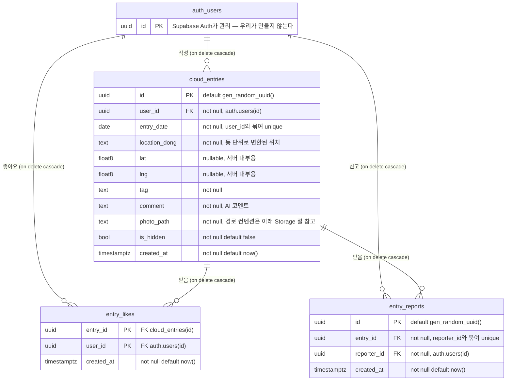

# ERD — Supabase 스키마 현황

지금 Supabase에 **실제로 올라가 있는** 스키마. 진실 소스는 `supabase/migrations/`의 `0001_init.sql` + `0002_entry_feed_is_mine.sql` + `0003_revoke_coords_select.sql` + `0004_opaque_photo_path.sql`이고 넷 다 적용 완료다(0003은 2026-09-05, 0004는 2026-09-08 적용). `0005_backfill_photo_owner.sql`(데이터 보정, 스키마 변경 아님)도 2026-09-08 적용 완료다 — 이 문서는 그 최종 상태를 그린 것이지 계획이 아니다. 스키마를 바꾸면 마이그레이션을 추가하고 이 문서를 같이 고친다.

`0002`가 `entry_feed` 뷰를 `drop` 후 재생성했으므로 `0001`의 뷰 정의(`e.*` + `likes_count`)는 더 이상 존재하지 않는다.

## 테이블



`auth_users`는 Mermaid가 점을 못 받아서 쓴 표기이고 실제 이름은 **`auth.users`** — Supabase Auth가 관리하는 테이블이라 우리 마이그레이션이 만들지 않고 FK로 참조만 한다.

**모든 FK가 `on delete cascade`다.** 탈퇴(= `auth.users` 행 삭제) 한 번으로 그 사람의 기록·좋아요·신고가 전부 따라 지워진다 — 제품 스펙의 "탈퇴 시 즉시 전체 삭제"(→ `PRODUCT.md` "확정된 제품 스펙")가 앱 코드의 성실함이 아니라 DB 제약으로 보장된다. 다만 Storage 파일은 cascade 대상이 아니라 `DELETE /api/account`가 따로 지운다.

`entry_likes`는 대리키 없이 `(entry_id, user_id)`가 곧 PK다 — 같은 사람이 같은 글에 두 번 좋아요를 누를 수 없다는 뜻.

## 하루 1장은 DB가 강제한다

```sql
unique (user_id, entry_date)
```

**앱 코드의 "오늘 이미 찍었나?" 체크가 아니라 이 제약이 실제 집행 지점이다.** 즉석 촬영 하루 1장은 서비스 정체성이라(→ `PRODUCT.md` "확정된 제품 스펙") 클라이언트 검사만으로 두면 동시 요청·조작된 요청으로 뚫린다. 여기가 막혀 있으므로 두 번째 저장은 Postgres unique violation(`23505`)으로 떨어지고, Route Handler는 그 코드를 잡아 "오늘은 이미 기록했어요"로 바꿔준다.

날짜 값 자체는 클라이언트를 믿지 않고 서버가 KST 기준으로 다시 계산한다(→ `.claude/skills/supabase-patterns/SKILL.md` "Route Handler 작성 관례").

## `entry_feed` — 테이블이 아니라 뷰

`cloud_entries`를 감싼 **뷰**다. 행을 저장하지 않고, 쓰기도 하지 않는다. **피드·사진첩의 목록 조회도, 단건 확인(`fetchMyTodayEntry`, `is_mine`으로 거른다)도 이 뷰만 읽는다** — `cloud_entries`를 직접 치는 건 삭제뿐이다.

내보내는 컬럼은 정확히 8개:

| 컬럼 | 출처 |
| --- | --- |
| `id`, `entry_date`, `location_dong`, `tag`, `comment`, `photo_path` | `cloud_entries`에서 그대로 |
| `likes_count` | **계산** — `entry_likes`의 해당 `entry_id` 개수 서브쿼리 |
| `is_mine` | **계산** — `public.entry_is_mine(e.id)` (아래 "컬럼 권한" 참고) |

**`user_id` / `lat` / `lng` / `is_hidden` / `created_at`은 뷰에 없다.** 특히 앞의 셋은 의도적으로 뺀 것이다 — 이유는 `0002_entry_feed_is_mine.sql` 상단 주석에 적혀 있다.

`is_mine`이 표현식이 아니라 함수인 이유도 같은 뿌리다 — 뷰가 `security_invoker`라 `e.user_id`를 직접 비교하면 조회자에게 그 컬럼 권한이 필요했고, 그 권한이 곧 `user_id` 노출 경로였다. `0004`가 비교만 `security definer` 함수로 내리고 컬럼 권한을 회수했다.

`is_mine`은 비로그인일 때 `auth.uid()`가 `null`이라 **`null`로 내려온다**(실제 anon 조회로 확인). 앱에서 `false`로 접는다.

### `security_invoker = true`가 왜 필수인가

Postgres 뷰는 기본값(`security_invoker = false`)에서 **뷰 소유자 권한**으로 실행된다. 소유자는 `postgres`고 RLS를 우회할 수 있으므로, 이 옵션을 빼는 순간 `cloud_entries`의 RLS가 통째로 무력화된다 — 숨김 처리된 글, 남의 글이 전부 뷰를 통해 그대로 나간다. `true`로 두면 조회한 사용자 권한으로 실행되어 아래 RLS 정책이 그대로 적용되고, 그래서 뷰에는 별도 정책이 필요 없다.

## RLS 정책

세 테이블 모두 `enable row level security`. 정책에 없는 동작은 전부 막힌다.

| 테이블 | 동작 | 조건 |
| --- | --- | --- |
| `cloud_entries` | select | `not is_hidden or auth.uid() = user_id` |
| | insert | `auth.uid() = user_id` |
| | delete | `auth.uid() = user_id` |
| | update | **정책 없음 → 클라이언트는 수정 불가** |
| `entry_likes` | select | `true` (좋아요 수는 공개값) |
| | insert / delete | `auth.uid() = user_id` |
| `entry_reports` | insert | `auth.uid() = reporter_id` |
| | select | `auth.uid() = reporter_id` (내 신고만 보인다) |
| | delete | **정책 없음 → 신고 취소 불가** |

**`cloud_entries_select`의 `not is_hidden or auth.uid() = user_id`가 숨김 처리의 실제 집행 지점이다.** 피드 쿼리에 `is_hidden` 필터를 안 걸어도 숨겨진 글은 DB에서 이미 잘려 나간다. 뒤의 `or`절 덕분에 본인은 자기 글이 숨겨져도 사진첩에서 계속 볼 수 있다.

`update` 정책이 없다는 게 짝을 이룬다 — `is_hidden`을 클라이언트가 되돌릴 수 없다. 유일하게 그 값을 바꾸는 건 아래 트리거다.

## 컬럼 권한 — RLS가 못 막는 층

RLS는 **행**을 막고, 여기 권한은 **컬럼**을 막는다. 둘은 서로를 대신하지 못한다.

`0003`이 `anon`/`authenticated`의 테이블 단위 select를 회수하고 `lat`/`lng`를 뺀 9개 컬럼만 다시 부여했다.

```sql
revoke select on public.cloud_entries from anon, authenticated;
grant select (id, user_id, entry_date, location_dong, tag, comment, photo_path, is_hidden, created_at)
  on public.cloud_entries to anon, authenticated;

revoke select (user_id) on public.cloud_entries from anon, authenticated;  -- 0004
```

**`revoke select (lat, lng)` 한 줄로는 안 된다** — Postgres에서 테이블 단위 select 권한을 들고 있으면 그게 모든 컬럼을 덮어서 컬럼 단위 revoke가 효과가 없다. 테이블 권한을 먼저 회수하고 필요한 컬럼만 다시 줘야 한다.

**`user_id`는 `0004`에서 빠졌다.** `0003`은 두 곳이 이 컬럼에 기대고 있어 남겨뒀었다 — `entry_feed`의 `is_mine`(`security_invoker`라 조회자 권한으로 계산)과 `fetchMyTodayEntry`의 필터(Postgres는 필터에 쓰는 컬럼에도 select 권한을 요구한다). 그 사이 `GET /rest/v1/cloud_entries?select=user_id,photo_path` 한 줄이면 "이 사진들이 같은 사람 것"이라는 그룹핑이 그대로 나왔고, 그건 `0002`가 막으려던 정보 그 자체였다.

`0004`가 둘을 함께 옮겨서 회수했다:

- `is_mine`은 `security definer` 함수 `public.entry_is_mine(entry uuid)`가 계산한다. 함수 본문이 소유자 권한으로 돌아 컬럼 권한이 필요 없고, 돌려주는 건 "네 것이냐" boolean 하나다. 뷰는 `security_invoker = true`인 채로 남아 RLS는 그대로 걸린다.
- `fetchMyTodayEntry`는 `cloud_entries` + `user_id` 필터에서 `entry_feed` + `is_mine` 필터로 옮겼다.

**RLS 정책은 이 회수와 무관하게 계속 동작한다** — `auth.uid() = user_id` 같은 정책 표현식은 조회자의 컬럼 권한 검사 대상이 아니다.

좌표 **저장**은 계속 된다 — insert 권한은 select와 별개고, `POST /api/entries/confirm`의 `.select()` 반환 목록에 `lat`/`lng`가 없다.

## 신고 3건 → 자동 숨김

```
entry_reports에 insert
  → 트리거 trg_hide_entry_after_reports (after insert, for each row)
  → 함수 hide_entry_after_reports()
      해당 entry_id의 신고 수 >= 3 이면
      update cloud_entries set is_hidden = true
```

함수는 `security definer` + `set search_path = public`이다. **`definer`가 아니면 동작하지 않는다** — 신고자 권한으로 돌면 (1) `entry_reports` select 정책이 "내 신고만"이라 누적 개수를 셀 수 없고, (2) `cloud_entries`에 update 정책이 없어 숨김 처리를 못 한다.

숨김은 삭제가 아니다. 행은 남고 `is_hidden`만 `true`가 되며, 실제로 안 보이게 만드는 건 위의 select 정책이다.

신고 버튼 + 누적 시 자동 숨김은 전체공개 서비스의 최소 안전장치라 약화·누락시키지 않는다(→ `REVIEW-STANDARD.md` "스코프 가드레일").

## Storage

버킷 **`entry-photos`** (public). SQL로 만들 수 없어 대시보드에서 수동 생성했다 — 절차는 `0001_init.sql` 하단 "Storage 설정" 주석.

경로 컨벤션: **`{uuid}.jpg`** — 폴더 없이 촬영마다 새로 만든다(`0004`). uid도 날짜도 담지 않는다. `photo_path`는 `entry_feed`를 통해 전체공개로 나가는 값이라, 예전 컨벤션(`{user_id}/{entry_date}.jpg`)에선 폴더명이 곧 user_id였다.

`storage.objects` 정책 4종:

| 동작 | 조건 |
| --- | --- |
| insert | `bucket_id = 'entry-photos'` (`to authenticated`) |
| update / delete | `bucket_id = 'entry-photos' and owner_id = auth.uid()::text` (`to authenticated`) |
| select | `bucket_id = 'entry-photos'` (누구나 읽기 — 피드가 전체공개라) |

**소유권 판정은 `owner_id`가 한다** — storage-api가 업로드 시 채워주는 업로더 uid다. 경로가 불투명해진 대신 소유권이 경로 밖으로 나왔다. insert만 소유권을 안 따지는데, 새로 올리는 파일엔 "누구 것"이라 할 근거가 경로에도 DB에도 없기 때문이다. 이름이 uuid라 남의 파일을 겨냥할 수 없고 덮어쓰기는 update 정책이 막는다.

**파일을 지우는 두 경로가 서로 다른 걸 쓴다:**

- `deleteEntryRemote`(클라이언트)는 **삭제한 행이 돌려주는 `photo_path`**로 지운다 — 경로를 uid+날짜로 재구성할 수 없어서다. 행을 먼저 지우므로 스토리지 삭제가 실패해도 사진 없는 기록이 남지는 않는다.
- `DELETE /api/account`는 **두 목록의 합집합**을 지운다 — `public.entry_photo_paths(target uuid)`(`security definer`, service_role 전용)가 주는 업로더 기준 목록과, 내 `cloud_entries`의 `photo_path`. 앞의 것만 쓰면 `owner_id`가 빈 파일이 빠지고, 뒤의 것만 쓰면 기록까지 안 간 사진(미리보기 후 이탈)이 빠진다. 둘 중 하나라도 조회에 실패하면 계정을 지우지 않고 멈춘다(사진만 남으면 되돌릴 수 없다). storage 스키마는 PostgREST에 노출돼 있지 않아 service_role 키로도 직접 못 읽어서 함수로 열었다.

**service role로 `copy`/`move`하면 `owner_id`가 따라오지 않는다**(2026-09-08 확인 — 복사본이 `entry_photo_paths`에 안 잡혔다). 파일을 서버에서 옮기면 그 파일은 업로더를 잃어 탈퇴 삭제가 놓친다 — 옮길 일이 생기면 `owner_id` 복구를 같은 작업에 묶는다.

**적용 시점(2026-09-08)에 남아 있던 옛 경로 파일은 같은 날 정리했다** — 기록이 참조하던 3행은 `{uuid}.jpg`로 이관하고(파일 copy → `photo_path` 백필 → 옛 파일 삭제), 참조 없던 1개는 지웠다. 버킷에 폴더가 없으니 목록으로도 uid가 안 샌다. 이관한 3개는 `0005`로 `owner_id`도 채워, `entry_photo_paths`로 잡힌다(anon 키·service role 키 둘 다로 확인).

## 알려진 한계

원본 좌표는 `0003`의 컬럼 권한으로, `user_id`의 두 노출 경로(`photo_path` 폴더명 / `cloud_entries.user_id`
컬럼)는 `0004`로 막혔다 — 위 "컬럼 권한"과 "Storage" 참고.

**`entry_likes`는 아직 열려 있다.** select 정책이 `using (true)`라
`GET /rest/v1/entry_likes?select=entry_id,user_id`가 그대로 응답한다 — 사진이 아니라 좋아요 기준의
그룹핑이지만 뿌리는 같다. 배경과 고칠 조건은 → [`TODO.md`](TODO.md) §2-1.
